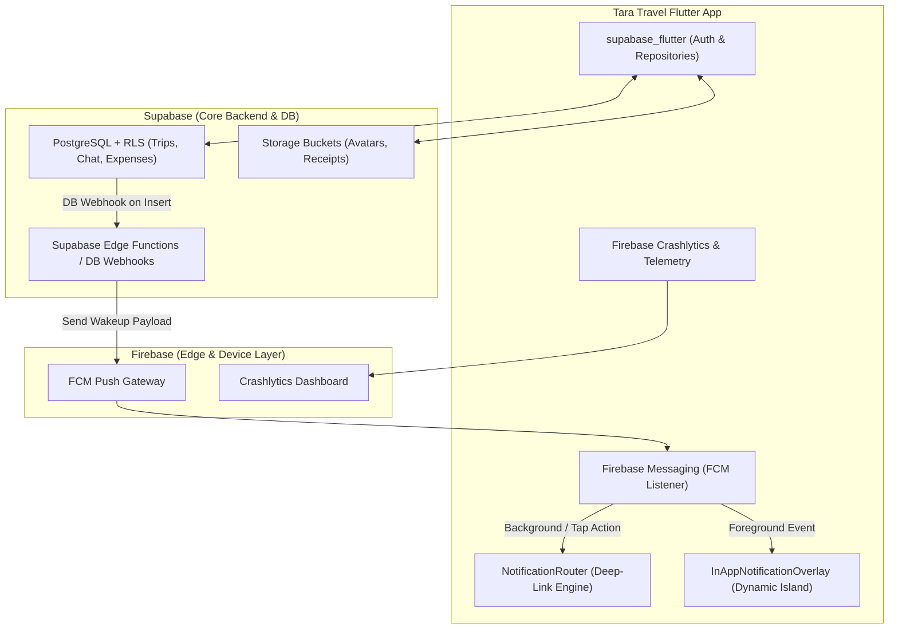

# Tara Travel — Master Feature & Implementation Roadmap

This document serves as our compiled repository master plan, organized hierarchically from **Minor Updates (UI Polish, Guards & Privacy)** through **Medium Features (Domain Models & Local Services)** to **Major Architectural & Platform Upgrades (End-to-End Systems, AI & Middleware)**.

---

## 📋 Table of Contents & Status Summary (Organized Minor → Major)

### 🟢 Tier 1: Minor Updates (UI Polish, Guards & Privacy Controls)
| # | Plan / Feature | Status | Key Focus |
|---|---|---|---|
| **1** | [Role-Aware Trip Exit: "Leave Trip" vs "Delete Trip"](#plan-1-role-aware-trip-exit-leave-trip-vs-delete-trip) | 🟢 **Complete** | Non-owners/members leave trip instead of delete; owner retains delete privilege |
| **2** | [Invite Code Privacy & Safe Area Gesture Clearance](#plan-2-invite-code-privacy-safe-area-gesture-clearance) | 🟢 **Complete** | Masked codes (`******`), auto-hide timer, bottom sheet `MediaQuery` insets & gesture clearance |
| **3** | [Offline Read-Only Guard & Action Freezing](#plan-3-offline-read-only-guard-action-freezing) | 🟢 **Complete** | Disables/locks write actions when disconnected, prevents stale sync errors, visual offline badges |
| **4** | [Cloud-Native Avatar Storage & CDN Cache Architecture](#completed-plans-summary) | 🟢 **Complete** | Supabase Storage bucket (`avatars`), WebP/quality compression & CachedNetworkImage integration |

### 🟡 Tier 2: Medium Features (Domain Tools, Local Logic & Services)
| # | Plan / Feature | Status | Key Focus |
|---|---|---|---|
| **5** | [Google Maps & Pin Location Integration](#completed-plans-summary) | 🟢 **Complete** | Paste GMap link, auto-fill itinerary, pin-drop flying, zero-cost resolution |
| **6** | [Tri-Modal Land Transport (Private, Commute, Rental) & Vehicle Garage Fuel Estimator](#plan-6-tri-modal-land-transport-private-commute-rental--vehicle-garage-fuel-estimator) | 🟢 **Complete** | Finalized 3 land modes (Private, Commute, Rental; strictly no sea/plane), user garage, live fuel prices & rental splitting |
| **7** | [Travel Circles (Squads & Barkada Presets) for Multi-Member Trip Creation](#plan-7-travel-circles-squads-barkada-presets-for-multi-member-trip-creation) | 🟡 **Drafted / Queued** | Friend circles/squad presets, 1-tap batch addition, smart co-traveler suggestions & deduplication |
| **8** | [Real-Time Live Weather Forecast & Severe Condition Alerts Engine](#plan-8-real-time-live-weather-forecast-severe-condition-alerts-engine) | 🟢 **Complete** | Open-Meteo API integration, offline caching, itinerary day-strip weather & severe storm alerts |
| **9** | [Dual-Lens Budget & Expense Hub (Personal Pocket Tracker + Group Trip Summary)](#plan-9-dual-lens-budget-expense-hub-personal-pocket-tracker-group-trip-summary) | 🟡 **Drafted / Queued** | Private personal expenses, "My True Trip Cost", cash/GCash tracking & daily burn pace meter |
| **10** | [Flexible & Optional Trip Map: Adventure, Multi-Point & Off-Grid Mode](#plan-10-flexible-optional-trip-map-adventure-multi-point-off-grid-mode) | 🟡 **Drafted / Queued** | Optional map tracking, multi-point waypoints, adventure trail roaming, battery-saving mapless mode |
| **11** | [Meet-up Assembly, Smart Countdown & Automatic Departure Detection](#plan-11-meet-up-assembly-smart-countdown-automatic-departure-detection) | 🟢 **Complete** | Day 1 Stop 0 auto-insertion, meet-up grace period, GPS distance countdown & auto departure |
| **12** | [Floating Travel Bubble & System Overlay HUD (PiP / Chathead Mode)](#plan-12-floating-travel-bubble-system-overlay-hud-pip-chathead-mode) | 🟢 **Complete** | In-app floating bubble + opt-in `SYSTEM_ALERT_WINDOW` convoy overlay, live radar & quick expense logging |
| **20** | [Chat Announcements Engine & Trip Detail Command Hub](#plan-20-chat-announcements-engine--trip-detail-command-hub) | 🟢 **Complete** | Pinned announcements, priority tinting (Urgent vs Notice), live banner on Trip Detail & chat deep-linking |
 
### 🔴 Tier 3: Major Architecture & Platform (End-to-End Systems, AI & Middleware)
| # | Plan / Feature | Status | Key Focus |
|---|---|---|---|
| **13** | [Trip Detail Screen: Ongoing Command Center, HUD & Quick Action Hub](#plan-13-trip-detail-screen-ongoing-command-center-hud-quick-action-hub) | 🟢 **Complete** | Active Quick Stop HUD, persistent bottom bar, telemetry, officers, announcements & weather |
| **14** | [Day Map Intelligent Route Optimization, OSRM Road Snapping & Offline Map Tile Cache](#plan-14-day-map-intelligent-route-optimization-osrm-road-snapping--offline-map-tile-cache) | 🟡 **Drafted / Queued** | Street-network OSRM routing, offline tile caching, best order optimization, arrival geofence |
| **15** | [Comprehensive Mobile Notifications Architecture (Push, In-App Banners & Deep-Link Routing)](#plan-15-comprehensive-mobile-notifications-architecture-push-in-app-banners-deep-link-routing) | 🟢 **Complete** | In-app Dynamic Island banners, background Heads-Up floating alerts, local alarms, FCM push & deep routing |
| **16** | [Gemini Embedded AI Travel Copilot & Assistant](#plan-16-gemini-embedded-ai-travel-copilot-assistant) | 🟢 **Complete** | Natural language trip planner, smart itinerary recommendations, budget optimization & packing generator |
| **17** | [Supabase & Middleware App Versioning & OTA Updates](#plan-17-supabase-middleware-app-versioning-ota-updates) | 🟡 **Drafted / Queued** | Version gatekeeper, Shorebird OTA code push, Supabase storage APK download & force/soft update dialogs |
| **18** | [Tara Laravel Middleware & SuperAdmin Dashboard (Universal Links, CMS & Ops)](#plan-18-tara-laravel-middleware-superadmin-dashboard-universal-links-cms-ops) | 🟡 **Drafted / Queued** | Web-to-app deep linking gateway, Filament v3 CMS, trip templates, feedback helpdesk & remote config |
| **19** | [Universal Responsive Layout Engine & Zero-Overflow Architecture](#plan-19-universal-responsive-layout-engine--zero-overflow-architecture) | 🟢 **Complete** | Breakpoints, clamped text scaler, safe padding/insets, zero hardcoded MediaQuery dimensions |
| **21** | [Unified Firebase & Supabase Cloud Ecosystem (Remote FCM, Crashlytics & Real-Time Sync)](#plan-21-unified-firebase--supabase-cloud-ecosystem-remote-fcm-crashlytics--real-time-sync) | 🟡 **Drafted / Queued** | Dual-cloud architecture: Supabase backend/RLS/storage + Firebase device-wake push (FCM), Crashlytics & telemetry |
| **22** | [Advanced Convoy Telemetry, Formation Radar & Geofenced Rendezvous](#plan-22-advanced-convoy-telemetry-formation-radar--geofenced-rendezvous) | 🟡 **Drafted / Queued** | Lead/tail pace radar, individual stop ETAs, auto-arrival geofencing, midpoint gathering & background PiP HUD |

### 📱 Screen-by-Screen & Batching Index
- [Screen-by-Screen Feature Matrix & Implementation Clusters](#-screen-by-screen-feature-matrix--implementation-clusters)
- [Recommendations for Batch Execution](#-recommendations-for-batch-execution)

---


## 🟢 Completed Plans Summary

| Plan | Title | Milestone | Status | Key Deliverable |
| :--- | :--- | :--- | :--- | :--- |
| **Plan 1** | Role-Aware Trip Exit ("Leave" vs "Delete") | IMP-081 | ✅ Complete | Member leave vs owner delete with role validation & UI guards. |
| **Plan 2** | Invite Code Privacy & Safe Area Clearance | IMP-082 | ✅ Complete | Masked codes (******), auto-hide timer, safe area gesture clearance. |
| **Plan 3** | Offline Read-Only Guard & Action Freezing | IMP-083 | ✅ Complete | Offline write locks, visual badges, and stale sync error prevention. |
| **Plan 4** | Cloud-Native Avatar Storage & CDN Cache Architecture | IMP-082 | ✅ Complete | Supabase Storage avatars bucket, ProfileRepository upload, and MemberAvatarCircle. |
| **Plan 5** | Google Maps Link Resolver & Pin Location Integration | IMP-117 | ✅ Complete | Zero-cost GMap URL resolver, Nominatim reverse geocode, instant camera fly, and itinerary auto-fill. |
| **Plan 6** | Tri-Modal Land Transport & Garage Fuel Estimator | IMP-131 | ✅ Complete | 3 land modes (Private, Commute, Rental), Profile Garage manager, DOE fuel cost calculator & transit hubs. |
| **Plan 7** | Travel Circles (Squads & Barkada Presets) | IMP-132 | ✅ Complete | Reusable travel squads/circles, 1-tap multi-member addition in trip creation, full CRUD management tab. |
| **Plan 8** | Real-Time Live Weather Forecast & Severe Alerts | IMP-088 | ✅ Complete | Open-Meteo API integration, offline cache, DayStrip weather & storm alerts. |
| **Plan 12** | Floating Travel Bubble & Overlay HUD | IMP-129 | ✅ Complete | In-app draggable edge-snapping bubble, mini-HUD card, and quick expense logging. |
| **Plan 13** | Trip Detail Screen: Ongoing Command Center & HUD | IMP-089 | ✅ Complete | Quick Stop HUD, persistent bottom dock, destination weather, officers. |
| **Plan 15** | Comprehensive Mobile Notifications Architecture | IMP-129 | ✅ Complete | In-App Dynamic Island toasts, duplicate suppression, and NotificationRouter deep links. |
| **Plan 17** | Supabase App Versioning & OTA Updates | IMP-094 | ✅ Complete | 3-tier update modals, Remote Config, automated CI/CD release pipeline. |
| **Plan 19** | Universal Responsive Layout Engine | IMP-091 | ✅ Complete | Breakpoints, clamped text scaler, safe padding/insets, zero-overflow. |

*Full architectural specifications and schemas for completed plans are preserved in docs/MEMORY.md and docs/IMPLEMENTATION_MEMORY.md.*

---

## 🟡 Active Implementation Plans

## Plan 5: Google Maps Link Resolver & Pin Location Applicable

### Goal
Make Google Maps directly applicable as a way to get places, pin locations on the map, and auto-fill itinerary stops when pasting links (`maps.app.goo.gl`, place links, or coordinates).

### Core Capabilities
1. **Google Maps Link Paste**:
   - Accepts shortened links (`https://maps.app.goo.gl/...`), web links (`google.com/maps/place/...`), or raw lat/long coordinates.
   - Follows HTTP redirects safely via Dio without requiring paid Google Maps API keys.
   - Extracts coordinates (`lat`, `lng`) and location keywords via regex.
2. **Reverse Geocoding & Name Resolution**:
   - Integrates with `PhilippineGeocodingService` to retrieve clean place titles, barangays, municipalities, and provinces.
3. **Interactive Pinning in `MapPinPickerModal`**:
   - Pasting a Google Maps link or coordinates into the map pin search bar immediately flies the camera (`_mapController.move`) and pins the exact location.
   - Includes an "Open in Google Maps" action to view the native pin for validation.
4. **Itinerary Auto-Fill in `AddStopForm`**:
   - Pasting a link fills:
     - **Location & Coordinates** (`lat`, `lng`).
     - **Stop Title** (if empty).
     - **Stop Type Guessing** (Hotel, Food, Transport, Activity) based on place naming patterns.

### Impacted Files
- `lib/core/services/google_maps_parser_service.dart` *(NEW)*
- `lib/core/widgets/inputs/location_picker.dart` *(MODIFY)*
- `lib/core/widgets/inputs/map_pin_picker_modal.dart` *(MODIFY)*
- `lib/features/itinerary/widgets/add_stop_form.dart` *(MODIFY)*
- `test/services/google_maps_parser_service_test.dart` *(NEW)*

---

---


## Plan 6: Tri-Modal Land Transport (Private, Commute, Rental) & Vehicle Garage Fuel Estimator

### Goal
Establish a finalized, strictly land-based **Tri-Modal Transport Architecture** for Tara Travel, categorizing all trips into three distinct modes: **`private` (Personal Vehicle / Convoy)**, **`commute` (Public Transit)**, and **`rental` (Hired / Chartered Vehicle)**. Permanently eliminate all air (`plane`, flights, airport hubs) and sea (`ferry`, shipping lines, boat piers) transport from models, creation wizards, and preset databases. Decouple vehicle configuration into the **User Profile / Settings ("My Garage / My Vehicles")**, while providing tailored travel intelligence: real-time Philippine fuel prices (DOE weekly monitoring) & km/L consumption for private vehicles, land transit terminal hubs (PITX, Cubao, Buendia) & per-pax fare calculators for commute, and daily contract rates with driver fee and fuel policy toggles for rental vans.

### Ground-Truth Schema & Invariants
- **`trips` Table**: Persists high-level `transport_mode` (`'private' | 'commute' | 'rental'`) and mode-specific payload `transport_meta` (JSONB).
- **Strict Prohibition ("No Sea or Plane")**: Tara Travel is anchored on land journeys across Philippine highways and scenic routes. Never query, store, or display air or maritime fields (`flight_number`, `pier`, `airline`, `airport_code`, `ferry_line`).

---

### Core Capabilities

#### 1. Tri-Modal Land Transport Classification (Strictly No Sea or Plane)
- **Eliminate Air & Maritime Transport**:
  - Remove all flight tracking, PNR/booking reference inputs, airline labels, shipping lines, pier names, and airport codes.
  - Drop airport presets (NAIA, Clark, MCIA) and seaport presets (Batangas Port, North Harbor, Cebu Pier 1).
  - Streamline `TransportCategory` to land-only.
- **The Three Land Transport Types**:
  1. **`private`**: Own vehicle (Car, SUV, AUV, Motorcycle, Bicycle) driven by trip participants or traveling in convoy.
  2. **`commute`**: Public land transportation (Provincial/City Bus, Jeepney / E-Jeep, Tricycle, UV Express / FX).
  3. **`rental`**: Chartered or leased private vehicle (Van Hire e.g. HiAce/Urvan, Car Rental, Tourist Coaster).

---

#### 2. Mode A: Private Vehicle (`private`) & User Garage
- **Zero Friction Creation Flow**:
  - Trip setup requires only selecting "Private Vehicle" without entering license plates, vehicle models, or fuel efficiency specs upfront.
- **User Profile "My Garage / My Vehicles"**:
  - Dedicated vehicle manager in user profile/settings:
    - **Nickname / Model**: (e.g. *Toyota Vios 1.5G*, *Yamaha NMAX 155*, *Mitsubishi Montero*).
    - **Vehicle Type**: `sedan`, `suv`, `auv`, `van`, `motorcycle`, `bicycle`.
    - **License Plate / Conduction Sticker**: (optional, for coding notifications).
    - **Fuel Efficiency**: Rated in **km/L** (e.g. `14.2 km/L`).
    - **Fuel Type**: `gasoline`, `diesel`, `electric`.
  - Supports multiple vehicles and a designated primary default.
- **Trip-Level Assignment & Convoy Radar**:
  - Link a saved garage vehicle to the trip in 1 tap (or specify ad-hoc specs).
- **Real-Time DOE Fuel Prices via Edge Function (`fetch-fuel-prices`)**:
  - Deno Edge Function aggregates weekly Philippine Department of Energy (DOE) fuel advisories across Metro Manila, Luzon, Visayas, and Mindanao (Gasoline, Diesel). Caches prices with 24-hour TTL.
  - Users can optionally override with their exact gas station pump receipt price.
- **Automatic Route Fuel Calculation**:
  - Uses Day Map route distance (km), assigned vehicle's km/L, and live regional fuel price:
    $$\text{Liters Needed} = \frac{\text{Total Route Distance (km)}}{\text{Vehicle Efficiency (km/L)}}$$
    $$\text{Estimated Fuel Cost} = \text{Liters Needed} \times \text{Live Fuel Price per Liter (PHP)}$$
- **Gas & Toll Expense Splitting**:
  - When `split_gas` is enabled:
    - Auto-generates an itemized fuel proposal in the Expenses tab.
    - Divides fuel + tollway costs fairly among designated passengers:
      $$\text{Cost Per Passenger} = \frac{\text{Estimated Fuel Cost} + \text{Estimated Tolls}}{\text{Passenger Count}}$$

---

#### 3. Mode B: Public Commute (`commute`) & Land Transit Hubs
- **Tailored for Public Transit Travelers**:
  - Eliminates fuel, km/L, and vehicle maintenance overhead.
- **Philippine Land Transit Departure Hubs (Preset Library)**:
  - Replaces all airport/port presets with major land bus and commute hubs:
    - **PITX**: Parañaque Integrated Terminal Exchange (South/Bicol/Cavite/Batangas routes).
    - **Cubao Bus Port / Araneta Terminal**: Central bus hub (North/Central Luzon & Bicol routes).
    - **Buendia / Gil Puyat Terminal**: Pasay bus stations (Laguna, Batangas, Quezon).
    - **Dau Central Bus Terminal**: Mabalacat, Pampanga (North Luzon hub).
    - **Baguio Grand Terminal**: Gov. Pack Road (Cordillera routes).
    - **Cebu South / North Bus Terminals**: Central Visayas regional land hubs.
- **Per-Pax Fare Estimation**:
  - Direct input for ticket/fare cost per person (e.g., ₱450.00 bus fare per head).
  - Automatically calculates total group transit commitment:
    $$\text{Total Transit Cost} = \text{Fare Per Pax} \times \text{Traveler Count}$$
- **Transit Guidance**:
  - Route / liner operator name (e.g., *Victory Liner Deluxe*, *Genesis Transit*, *UV Express Megamall-Clark*), route code, and drop-off waypoint.

---

#### 4. Mode C: Vehicle Rental (`rental`) & Chartered Van Sharing
- **Tailored for Barkada Van Hire & Leased Vehicles**:
  - Designed specifically for rented tourist vans (HiAce Grandia, NV350 Urvan), self-drive cars, or chartered coasters.
- **Comprehensive Rental Pricing Model**:
  - **Rental Rate Structure**:
    - Daily rental rate (e.g., ₱3,500/day) $\times$ trip duration (days), or flat lump-sum charter fee.
  - **Driver Fee & Allowance Toggle**:
    - Option to declare driver inclusion:
      - *Driver Provided with Rental* vs *Self-Drive*.
      - Add driver daily allowance / meals (e.g., ₱500/day driver per diem).
  - **Fuel Policy Toggle**:
    - **Option 1: Fuel Included**: Rental company covers fuel (no additional gas calculation).
    - **Option 2: Fuel Excluded (Group Splits Gas)**: Integrates with the fuel estimator using standard van fuel consumption (e.g., `9.5 km/L` for Toyota HiAce).
  - **Toll Policy Toggle**: *Tolls Included in Package* vs *Group Splits RFID / Tollways*.
- **Automatic Budget & Shared Expense Insertion**:
  - Automatically posts the total van rental commitment into the group expense pool:
    $$\text{Total Rental Commitment} = (\text{Daily Rate} \times \text{Days}) + (\text{Driver Allowance} \times \text{Days}) + \text{Fuel/Tolls (if excluded)}$$
    $$\text{Individual Share} = \frac{\text{Total Rental Commitment}}{\text{Total Members}}$$

---

### Database Schema & `transport_meta` JSONB Structure

```sql
-- trips table columns remain:
-- transport_mode text check (transport_mode in ('private', 'commute', 'rental')),
-- transport_meta jsonb

-- 1. Private Mode transport_meta JSON:
{
  "mode": "private",
  "vehicle_id": "uuid-optional",
  "vehicle_name": "Toyota Vios 1.5G",
  "vehicle_type": "sedan",
  "fuel_type": "gasoline",
  "kml": 14.5,
  "split_gas": true,
  "split_tolls": true,
  "estimated_toll_cost": 480.00
}

-- 2. Commute Mode transport_meta JSON:
{
  "mode": "commute",
  "commute_type": "bus", -- 'bus', 'jeepney', 'tricycle', 'uv_express'
  "transit_hub_name": "PITX Terminal 1",
  "route_name": "Victory Liner Express to Baguio",
  "fare_per_pax": 520.00,
  "boarding_time": "05:00 AM",
  "drop_off_point": "Baguio Grand Terminal"
}

-- 3. Rental Mode transport_meta JSON:
{
  "mode": "rental",
  "rental_type": "van_hire", -- 'van_hire', 'car_rental', 'coaster'
  "vehicle_model": "Toyota HiAce Grandia 2023",
  "daily_rate": 3500.00,
  "rental_days": 3,
  "has_driver": true,
  "driver_fee_per_day": 500.00,
  "fuel_included": false,
  "tolls_included": false,
  "total_rental_cost": 12000.00
}
```

---

### UI Flow & Refactored `TransportStep` Component

1. **3-Way Hero Mode Selector**:
   - Clean, elevated cards displaying:
     - 🚗 **Private Vehicle** (*"Own car, motorcycle, or squad convoy"*)
     - 🚌 **Public Commute** (*"Bus, jeepney, tricycle, or UV Express"*)
     - 🚐 **Vehicle Rental** (*"Van hire, rented car, or chartered coaster"*)
2. **Contextual Adaptive Sub-Forms**:
   - Selecting **Private**: Shows Garage quick-select dropdown/chips, departure point, and `split_gas` toggle.
   - Selecting **Commute**: Shows land transit hub chips (PITX, Cubao, etc.), departure point, and fare per pax input.
   - Selecting **Rental**: Shows daily rental rate, rental days counter, driver fee toggle, and fuel inclusion switch.
3. **Responsive Safe Insets**:
   - Adheres to `AppResponsive`: wraps in `SingleChildScrollView(physics: BouncingScrollPhysics())`, uses `context.safeBottomPadding(base: 16)` and clamped text scales.

---

### Impacted Files & Architecture
- `lib/core/models/itinerary_model.dart` *(MODIFY — streamline `TransportMode` & `TransportCategory` to land modes, deprecate plane/ferry)*
- `lib/core/models/user_vehicle_model.dart` *(NEW — garage vehicle domain model)*
- `lib/core/models/fuel_price_model.dart` *(NEW — Philippine DOE fuel price model)*
- `lib/core/services/fuel_price_service.dart` *(NEW — Edge Function client with local cache)*
- `supabase/functions/fetch-fuel-prices/index.ts` *(NEW — Deno Edge Function fetching DOE data)*
- `lib/features/create_trip/steps/transport_step.dart` *(REFACTOR — eliminate airport/pier presets & flight/pier inputs; implement 3-mode card selector)*
- `lib/features/profile/profile_screen.dart` *(MODIFY — add "My Vehicles / Garage" entry tile)*
- `lib/features/profile/widgets/user_vehicles_sheet.dart` *(NEW — vehicle CRUD bottom sheet)*
- `lib/features/trip_detail/widgets/transport_summary_card.dart` *(MODIFY — adapt rendering for Private, Commute, or Rental)*
- `test/models/user_vehicle_model_test.dart` *(NEW)*
- `test/services/fuel_price_service_test.dart` *(NEW)*
- `test/features/create_trip/transport_step_test.dart` *(NEW)*

---

---


## Plan 7: Travel Circles (Squads & Barkada Presets) for Multi-Member Trip Creation `[COMPLETE — IMP-132]`

*(Originally proposed as IDEA-009)*

### Goal
Accelerate group trip creation for frequent friend circles, family barkadas, or recurring travel groups. Instead of manually selecting and inviting friends one by one on every trip, users can create and manage reusable **"Travel Circles" (Squads)** in their profile or friends tab, and add the entire roster to a new trip in **1 tap**.

### Core Capabilities
1. **1-Tap Batch Addition with Smart Deduplication**:
   - Tapping a Circle chip instantly adds all circle members into `widget.trip.travelers`.
   - Prevents duplicate insertions if individual members were already selected.
   - Shows progressive badge counter (e.g., *"5/5 from Barkada added"*).
2. **Zero-Maintenance Smart Circles**:
   - **Frequent Co-Travelers**: Automatically computed dynamic cohort based on co-membership in $\ge 2$ completed trips.
   - **Trip Clone Roster**: One-tap action to *"Re-invite roster from [Recent Trip Name]"*.
3. **Default Squad Roles & Expense Presets**:
   - Circle members can have preset roles (e.g., *Treasurer*, *Convoy Driver*).
   - In Step 2 (*Budget Setup*), preset equal split weights and default payer suggestions are automatically prepared.
4. **Single-Action Circle Onboarding (Invite Code / Link)**:
   - Circle owners can share a unique `circle_invite_code` across chat apps (Messenger/Viber/Telegram) to onboard members in one flow.
5. **Strict Privacy Invariant**:
   - All friend display names rendered within Circle cards adhere to `MemberModel.formatDisplayName(name, hideSurname: profile.hideSurname)`.

### Database Schema
```sql
-- 1. Travel Circles
CREATE TABLE public.friend_circles (
    id UUID PRIMARY KEY DEFAULT gen_random_uuid(),
    owner_id UUID NOT NULL REFERENCES auth.users(id) ON DELETE CASCADE,
    name TEXT NOT NULL CHECK (char_length(name) >= 1 AND char_length(name) <= 50),
    emoji TEXT DEFAULT '👥',
    color_hex TEXT DEFAULT '#D85A30',
    description TEXT,
    created_at TIMESTAMPTZ NOT NULL DEFAULT NOW(),
    updated_at TIMESTAMPTZ NOT NULL DEFAULT NOW()
);

-- 2. Circle Members Junction Table
CREATE TABLE public.friend_circle_members (
    id UUID PRIMARY KEY DEFAULT gen_random_uuid(),
    circle_id UUID NOT NULL REFERENCES public.friend_circles(id) ON DELETE CASCADE,
    friend_user_id UUID NOT NULL REFERENCES auth.users(id) ON DELETE CASCADE,
    default_role TEXT DEFAULT 'member', -- 'member', 'driver', 'treasurer'
    created_at TIMESTAMPTZ NOT NULL DEFAULT NOW(),
    UNIQUE (circle_id, friend_user_id)
);
```

### Impacted Files & Architecture
- `supabase/migrations/026_travel_circles.sql` *(NEW — tables, RLS policies, and index definitions)*
- `lib/core/models/friend_circle_model.dart` *(NEW)*
- `lib/core/repositories/friend_repository.dart` *(MODIFY — add circle CRUD & smart suggestions)*
- `lib/core/providers/friend_circles_provider.dart` *(NEW)*
- `lib/features/create_trip/steps/details_step.dart` *(MODIFY — integrate Circle chips into `_showSelectFriendsBottomSheet`)*
- `lib/features/friends/friends_screen.dart` *(MODIFY — add "Circles" management tab)*
- `test/models/friend_circle_model_test.dart` *(NEW)*
- `test/features/friends/friend_circles_test.dart` *(NEW)*

---

---


## Plan 9: Dual-Lens Budget & Expense Hub (Personal Pocket Tracker + Group Trip Summary)

*(Originally proposed as IDEA-012)*

### Goal
Transform the Budget screen into a comprehensive **Dual-Lens Financial Hub** that separates and harmonizes **Shared Group Expenses** (split meals, Airbnb, shared vans) with **Private Personal Expenses** (souvenirs, snacks, individual shopping, private transport). Calculates the traveler's **"True Trip Cost"** while providing daily spending pace meters and cash/GCash tracking.

### Core Capabilities
1. **Lens 1: "My Personal Pocket" (Private Expense & Cash Tracker)**:
   - Dedicated private spending budget (e.g., *"₱10,000 personal spending money"*).
   - Private expenses logged with 1 tap (strictly private to user via Supabase RLS, never split or visible to group).
   - **"My True Trip Cost"**: Sum of `(My Personal Out-of-Pocket) + (My Fair Share of Group Expenses)`.
   - Cash vs. GCash/Maya wallet balance tracking (essential for Philippine islands with limited ATMs).
2. **Lens 2: "Group Trip Finances" (Deep Trip Summary & Settlement)**:
   - Master shared expenses with category breakdown charts, split matrix, and debt settlement.
   - Group remaining runway & burn rate.
3. **Daily Budget Burn Gauge (Pace Meter)**:
   - Visual speedometer showing whether the traveler is *Under Budget*, *On Track*, or *Overspending* for the current day.
4. **Philippine Travel Quick Categories**:
   - Preset quick tags: *Tricycle/Jeepney*, *Pasalubong/Souvenirs*, *Island Environmental Fees*, *Street Food/Snacks*, *Activity/Tour Guide Tips*.

### Database Schema
```sql
-- 1. Personal trip budget in trip_members
ALTER TABLE public.trip_members 
ADD COLUMN IF NOT EXISTS personal_budget NUMERIC(12,2) DEFAULT 0.00;

-- 2. is_personal & payment_method in expenses
ALTER TABLE public.expenses 
ADD COLUMN IF NOT EXISTS is_personal BOOLEAN NOT NULL DEFAULT FALSE,
ADD COLUMN IF NOT EXISTS payment_method TEXT DEFAULT 'cash'; -- 'cash', 'gcash', 'card', 'maya'

-- 3. RLS Policy for Personal Expenses
CREATE POLICY "Personal expenses visible only to owner"
ON public.expenses FOR SELECT
USING (
    (is_personal = FALSE AND public.user_can_access_trip(trip_id))
    OR (is_personal = TRUE AND paid_by_user_id = auth.uid())
);
```

### Impacted Files & Architecture
- `lib/core/models/expense_model.dart` *(MODIFY — add `isPersonal`, `paymentMethod`)*
- `lib/core/providers/personal_budget_provider.dart` *(NEW — compute personal spent, group share, and pace meter)*
- `lib/features/budget/budget_screen.dart` *(MODIFY — add segmented switch: Personal Pocket vs Group Summary)*
- `lib/features/budget/widgets/personal_pocket_card.dart` *(NEW)*
- `lib/features/budget/widgets/daily_pace_gauge.dart` *(NEW)*
- `lib/features/expenses/widgets/add_expense_form.dart` *(MODIFY — add private expense toggle & payment method)*
- `test/providers/personal_budget_provider_test.dart` *(NEW)*

---

---


## Plan 10: Flexible & Optional Trip Map: Adventure, Multi-Point & Off-Grid Mode

### Goal
Decouple rigid map requirements so trips can be created and managed without requiring a fixed destination coordinate or mandatory map pins. Tailor the experience for **Adventure Trips** (spontaneous roaming, hikes, off-roading, camping) and **Multi-Point Journeys** (road trips hopping across multiple provinces, islands, or stops) without getting locked into a single fixed point on the map.

### Core Capabilities
1. **Optional Map & Destination Coordinates**:
   - Allows users to toggle **"Map Tracking / Route Visualizer"** ON or OFF during trip creation or within Trip Settings.
   - For relaxed staycations, retreat gatherings, or spontaneous exploration, trips do not force lat/long geocoding or show empty/broken map placeholders when coordinates are omitted.
2. **Adventure / Free-Roam Mode**:
   - Designed for treks, island hopping, trail hikes, and unpaved adventures where conventional street navigation is not applicable.
   - Replaces highway turn-by-turn routing with breadcrumb waypoint tracking, compass bearing heading, and elevation/waypoint milestone checklists.
   - Saves battery and cellular data by suspending persistent background tile fetching when off-grid or when offline.
3. **Multi-Point Waypoint Architecture**:
   - Extends trip itinerary routing to support journeys with multiple sequential hubs (e.g., Manila → Tagaytay → Batangas → Puerto Galera) rather than a single destination anchor.
   - The primary map adapts from a single destination pin into a multi-hub route overview connecting all major destination points.
4. **Adaptive UI & Bottom Dock Transformation**:
   - In `ItineraryBottomDock`, if map tracking is disabled:
     - The "Day Map" or "Live Nav" button gracefully adapts into a simplified **"Day Checklist / Timeline"** or **"Adventure Compass"** mode.
     - When stops do have pins, map actions remain optionally accessible on-demand rather than being forced as the primary hero CTA.
5. **Schema & Architectural Invariant Compliance**:
   - Strictly conforms to the Ground-Truth Schema (`trips` table uses `departure_point`, `departure_lat`, `departure_lng`, `destination_details`, and stop-level `itinerary_stops(latitude, longitude)` without referencing forbidden columns like `destination_lat`/`lng`).
   - Stores user map preferences (e.g. `is_map_enabled: false`, `journey_mode: 'adventure' | 'multi_point' | 'standard'`) safely inside `destination_details` JSONB without requiring database migrations.

### Impacted Files & Architecture
- `lib/features/create_trip/steps/details_step.dart` *(MODIFY — add toggle for Optional Map / Adventure / Multi-point mode)*
- `lib/features/itinerary/widgets/itinerary_bottom_dock.dart` *(MODIFY — dynamically adapt dock buttons when map is disabled or in adventure mode)*
- `lib/features/itinerary/widgets/itinerary_map_sheet.dart` *(MODIFY — support multi-point waypoints and graceful empty-coordinate handling)*
- `lib/features/trip_detail/widgets/trip_detail_quick_actions.dart` *(MODIFY — condition Map View action based on trip mode)*
- `test/features/itinerary/itinerary_map_optional_test.dart` *(NEW — verify UI and provider behavior with map enabled vs disabled)*

---

---


## Plan 11: Meet-up Assembly, Smart Countdown & Automatic Departure Detection

### Goal
Automatically insert the trip's specified **Meet-up Point / Departure Point** as the initial itinerary stop (**Day 1, Stop 0: "Meet-up & Assembly"**) and power it with real-time countdowns, customizable grace periods, smart preparation advisories, and automatic departure detection without requiring manual user input.

### Core Capabilities
1. **Automatic Day 1 Stop 0 Generation & Sync**:
   - When a trip is created with a `departure_point` (or updated with one), the system automatically provisions an itinerary stop:
     - **Name**: *"Meet-up & Assembly"* (or custom label e.g., *"Shell SLEX Northbound Assembly"*).
     - **Stop Type**: `transport` (or dedicated `meetup` icon 📍🤝).
     - **Location & Coordinates**: Populated with `departure_lat`, `departure_lng`, and `departure_point`.
     - **Stop Date / Time**: Set to Trip `start_date` at scheduled assembly time.
     - **Order Index**: `0` (guaranteed first stop before all subsequent destinations).
   - If the departure point is edited in Trip Details, the Stop 0 coordinates and location name automatically synchronize.
2. **Meet-up Time with Customizable Grace Period**:
   - **Target Assembly Time**: Set exact target meet-up time (e.g., `05:30 AM`).
   - **Configurable Grace Period**: Optional grace period buffer (e.g., `15 mins`, `30 mins`, or custom minutes).
   - **Wheels-Up / Hard Departure Time**:
     $$\text{Wheels Up Time} = \text{Assembly Time} + \text{Grace Period}$$
     (e.g., Assembly: `05:30 AM` • Grace Period: `15 mins` $\rightarrow$ Wheels Up: `05:45 AM`).
   - Clear visual countdown in Travel HUD & Stop Detail:
     - *"Assembly: 05:30 AM (15 min grace period until 05:45 AM departure)"*.
     - Dynamic urgency chips: *"On Time"*, *"Within Grace Period"*, or *"Late / Rolling Out"*.
3. **Live Countdown & Smart Preparation/Departure Advisory**:
   - Calculates distance between traveler's live GPS position and the departure point / upcoming stop:
     - Recommends preparation time (e.g. *"Prepare to leave by 7:15 AM (35 mins travel time + 15 min buffer)"*).
     - Live indicator: *"On Time"*, *"Leave in 10 mins"*, or *"Running Late"*.
4. **Full Companion Check-In & Arrival Support**:
   - Reuses `StopDetailSheet` companion roster: members mark themselves arrived at the meet-up point with live headcount (*"5/8 arrived at assembly point"*).
5. **Automatic Departure Detection**:
   - **Navigation Launch Trigger**: Opening navigation (*"Navigate"* or *"Open Navigation"* to in-app nav, Google Maps, or Waze) automatically flags departure and logs timestamp.
   - **GPS Movement & Velocity Trigger**: Exiting the departure geofence (>100–200m) or moving at transit speed (>15–20 km/h) automatically registers departure.
   - **Automated Convoy Notification**: Dispatches update to co-travelers: *"Juan has departed for [Stop Name]"*.
6. **Day Map & Street Navigation Integration**:
   - Day Map routing polyline starts directly from the Meet-up Point to Stop 1, ensuring the first driving/transit leg has complete street navigation and accurate total kilometer calculation.

### Impacted Files & Architecture
- `lib/core/services/departure_advisory_service.dart` *(NEW)*
- `lib/features/create_trip/create_trip_flow.dart` *(MODIFY - auto-insert Stop 0 upon trip creation)*
- `lib/core/repositories/trip_repository.dart` *(MODIFY - sync departure point edits with Stop 0)*
- `lib/core/models/itinerary_model.dart` *(VERIFY stop_type meetup support)*
- `lib/features/trip_detail/widgets/smart_departure_advisory_card.dart` *(NEW)*
- `test/services/departure_advisory_service_test.dart` *(NEW)*
- `test/features/itinerary/meetup_stop_auto_creation_test.dart` *(NEW)*

---

---


## Plan 12: Floating Travel Bubble & System Overlay HUD (PiP / Chathead Mode)

### Goal
Allow travelers, drivers, and convoy riders to minimize Tara Travel into a draggable **Floating App Overlay Bubble** (similar to Facebook Messenger chatheads or Google Maps navigation PiP/bubbles). The bubble hovers over external apps (such as Waze, Google Maps, Spotify, or Camera) or within Tara Travel itself, providing instant 1-tap access to live trip stats, next stop ETA, convoy companion distances, SOS alerts, and quick expense logging without switching apps.

### Core Capabilities
1. **Dual Overlay Modes (In-App vs System-Wide)**:
   - **Mode A: In-App Draggable Floating Bubble (Zero Special Permissions)**:
     - Built directly into the Flutter widget tree (`OverlayEntry` in `MaterialApp.builder`).
     - Floats over Itinerary, Chat, and Budget screens so travelers can roam different sections while keeping live convoy telemetry and next stop pinned.
   - **Mode B: System-Wide Overlay HUD (`SYSTEM_ALERT_WINDOW` & ForegroundService)**:
     - Opt-in background mode activated from `LiveNavigationScreen` or `TripDetailScreen` via *"Pop out Convoy Bubble"*.
     - Prompts traveler with clear educational dialog before checking `Settings.canDrawOverlays(context)`.
     - Hovers persistently on top of third-party apps like Google Maps and Waze during road trips.
2. **Draggable Bubble & Magnetic Physics**:
   - 56×56 circular badge with Tara Travel icon and dynamic status badge (e.g. speed, convoy distance, or vehicle icon).
   - Drags smoothly with magnetic snap-to-edge docking (left or right screen margin).
   - Bottom center flick-to-dismiss target (semi-transparent ⓧ target area).
3. **Compact Travel HUD Mini-Window (Tap to Expand)**:
   - Tapping the bubble expands a lightweight semi-transparent floating card over whatever app the user is currently using:
     - **Next Stop & ETA**: Destination name, remaining distance (km), and ETA clock.
     - **Convoy Radar**: Real-time distance to the closest squad member / tail vehicle.
     - **Quick Expense Log**: 1-tap button to quickly input a toll fee or gas expense without leaving navigation.
     - **Full App Restore**: Single tap to maximize Tara Travel back to full screen.
4. **Android Background Safety & Play Store Compliance**:
   - Complies with Android battery and foreground service guidelines by running via a designated `ForegroundService` with persistent low-priority status bar notification (*"Tara Travel Convoy Active — Tap to open bubble"*).
   - Automatically shuts down overlay service when the trip ends, user arrives at destination, or manually dismisses the bubble.

### Impacted Files & Architecture
- `android/app/src/main/AndroidManifest.xml` *(MODIFY — add `SYSTEM_ALERT_WINDOW` and `FOREGROUND_SERVICE` permissions & service declaration)*
- `pubspec.yaml` *(MODIFY — add `flutter_overlay_window`)*
- `lib/core/services/floating_bubble_service.dart` *(NEW — overlay lifecycle management, state synchronization, and permission handling)*
- `lib/features/navigation/widgets/floating_travel_bubble.dart` *(NEW — draggable in-app and system-overlay UI card)*
- `lib/features/trip_detail/widgets/trip_detail_quick_actions.dart` *(MODIFY — add "Pop out Bubble" trigger)*
- `test/core/services/floating_bubble_service_test.dart` *(NEW — test bubble launch, dismiss, and state stream)*

---

---


## Plan 14: Day Map Intelligent Route Optimization, OSRM Road Snapping & Offline Map Tile Cache

### Goal
Upgrade all map surfaces (Day Map, Live Navigation Map, and Itinerary stops) from drawing simple linear/straight-line connections to calculating and rendering **true road-snapped driving paths (OSRM street-level polylines)**, providing **offline map tile caching** for zero-signal Philippine provincial/island routes, adding **geocoding debounce safeguards**, and optimizing stop sequences (**TSP Route Optimizer**).

### Core Capabilities
1. **OSRM Turn-by-Turn Road Snapping (`OsrmRoutingService`)**:
   - Replaces straight direct lines with actual street-network driving polylines via the free, public OpenStreetMap OSRM routing engine (`https://router.project-osrm.org/route/v1/driving/{coords}?overview=full&geometries=geojson`).
   - Calculates realistic turn-by-turn road curves across highways, bridges, and mountain passes for both `LiveMapTab` and `ItineraryMap`.
   - Returns real distance (km) and estimated driving travel duration (minutes) dynamically.
2. **Offline & Remote Island Map Tile Caching (`MapTileConfig` & Cache Interceptor)**:
   - Wraps `FlutterMap` tile layer with local disk tile caching (`dio_cache_interceptor` / `flutter_map_cache`).
   - Traveler routes, loaded map regions, and stop areas remain viewable even when mobile data drops to zero in remote destinations (e.g., Sagada, Batanes, Siargao).
3. **Philippine Geocoding Safeguards & Debounce Engine**:
   - Enforces a minimum 400ms debounce buffer on all address inputs to strictly adhere to OpenStreetMap Nominatim's 1 req/sec policy and avoid HTTP 429 rate limits.
   - Combines with the existing 32-slot LRU memory cache and local persistent disk cache for instant repeat place suggestions.
4. **"Find Best Way" Intelligent Reordering (Optional TSP / Route Reorder)**:
   - Provide an "Optimize Day Route" action that computes the shortest travel distance/time among all day stops.
   - Prevents zigzagging across town by suggesting an optimized visit sequence.
   - Respects user-pinned fixed-time commitments (e.g., hotel check-ins, tour reservations) while reordering flexible stops in between.
5. **Mapbox Public Token Security & Origin Locking**:
   - Lock down Mapbox access token usage to the app's package identity (`ph.taratravel.app`) in the Mapbox console to prevent unauthorized third-party quota drainage.
6. **Automatic Arrival Pin Pop-up & Geofence Notification**:
   - **In-App Proximity Pop-up**: When the traveler's live GPS enters the target stop's radius (~50–100m geofence), trigger an arrival card / pin pop-up celebrating arrival: *"You have arrived at [Location Name]!"* with a 1-tap "Mark as Visited / Arrived" button.
   - **Local Push Notification**: If the app is in the background or device is locked, deliver an actionable local notification: *"Arrived at [Stop Name]? Tap to mark as completed."*
   - **Auto Status Progression**: Marking as arrived automatically updates the stop's status to `completed` in Supabase and progresses active routing to the next upcoming stop on the Day Map.

### Impacted Files & Architecture
- `lib/core/services/osrm_routing_service.dart` *(NEW — free public OSRM road geometry & ETA fetcher)*
- `lib/core/constants/map_tile_config.dart` *(MODIFY — integrate disk caching layer for offline tiles)*
- `lib/core/services/philippine_geocoding_service.dart` *(MODIFY — debounce guard & persistent search cache)*
- `lib/core/services/route_optimization_service.dart` *(NEW — TSP sequence optimizer)*
- `lib/core/services/geofence_arrival_service.dart` *(NEW — stop proximity detection)*
- `lib/features/navigation/widgets/live_map_tab.dart` *(MODIFY — replace straight-line routePoints with OSRM road polyline)*
- `lib/features/itinerary/widgets/itinerary_map.dart` *(MODIFY — render road-snapped route segments)*
- `lib/features/itinerary/widgets/arrival_dialog.dart` *(NEW)*
- `lib/features/itinerary/providers/itinerary_provider.dart` *(MODIFY)*
- `test/services/osrm_routing_service_test.dart` *(NEW)*
- `test/services/route_optimization_service_test.dart` *(NEW)*
- `test/services/geofence_arrival_service_test.dart` *(NEW)*

---

---


## Plan 15: Comprehensive Mobile Notifications Architecture (Push, In-App Banners & Deep-Link Routing)

### Goal
Deliver a unified, multi-tier notification and in-app event system for Tara Travel. Combines **Dynamic In-App Island Banners (when app is open)**, **High-Priority Android Heads-Up Notifications (floating over other apps when app is closed)**, **Local Timed Alarms**, **Remote Push Notifications (FCM)**, and **Contextual Deep-Link Routing** so travelers never miss critical trip updates and can act on alerts with a single tap.

### Core Capabilities
1. **Background Floating Banners (Android High-Priority Heads-Up Alerts)**:
   - When Tara Travel is **closed or minimized**, critical alerts float down from the top of the device screen over external apps (Google Maps, Waze, YouTube, or Home Screen) for 4–5 seconds.
   - Configured via Android `NotificationChannel` with `Importance.max` and `Priority.high`.
   - Actionable buttons embedded directly in the floating banner (`[Check In]`, `[Open Chat]`, `[View Stop]`).
   - Requires **only standard `POST_NOTIFICATIONS` permission** (100% Google Play Store compliant, zero battery/RAM penalty).
2. **Dynamic Island / Top Slide-Down In-App Banners (When App is Open)**:
   - Modern frosted-glass pill banner sliding smoothly from behind the status bar inside `MaterialApp.builder` when new events arrive while actively browsing Tara Travel.
   - Category-tinted avatars (Coral `#D85A30` for announcements/SOS, Amber `#EF9F27` for geofence arrivals, Green for expenses).
   - Gesture dismiss (swipe up to dismiss immediately) and 4-second auto-dismiss progress bar.
   - **Screen-Aware Duplicate Suppression**: Suppresses in-app floating banner if user is already actively viewing the exact screen of the event (e.g. no chat banner if currently in `ChatScreen`).
3. **Local Timed Alarms & Hybrid Sync**:
   - Schedules offline alarms for departure wheels-up (2h & 30m before meet-up), daily 7:00 AM itinerary summaries, and packing reminders.
   - Remote pings for trip invites, co-traveler expense logs, convoy SOS alarms, and unread chat messages.
4. **Contextual Deep-Link Routing (`NotificationRouter`)**:
   - Standardized payload format:
     ```json
     {
       "trip_id": "uuid",
       "target_screen": "expenses | itinerary | chat | packing | members",
       "target_item_id": "optional_item_uuid"
     }
     ```
   - **Tap Routing**:
     - Expense logged → opens `TripDetailScreen` Expenses tab or `ExpenseDetailModal`.
     - Stop arrival / geofence → opens `ItineraryScreen` focused on the stop with 1-tap `[Check In]`.
     - Chat ping → expands inline quick reply or opens `ChatScreen`.
     - Convoy alert → 1-tap `[Wait / Slow Down]` ping without leaving current screen.
   - Visual affordance: interactive cards feature trailing chevrons and hover/press ripple effects.

### Impacted Files & Architecture
- `pubspec.yaml` *(MODIFY — add `flutter_local_notifications: ^18.0.1`, `timezone: ^0.9.4`)*
- `android/app/src/main/AndroidManifest.xml` *(MODIFY — ensure `POST_NOTIFICATIONS`, `SCHEDULE_EXACT_ALARM`, and notification channel metadata)*
- `lib/core/services/notification_service.dart` *(NEW — unified manager coordinating local notification scheduling and channels)*
- `lib/core/services/notification_router.dart` *(NEW — central route resolver for notification payloads)*
- `lib/core/widgets/notifications/in_app_notification_overlay.dart` *(NEW — global overlay banner renderer with slide animations & gesture dismissal)*
- `lib/core/services/in_app_notification_manager.dart` *(NEW — FIFO queue manager, duplicate suppression, and audio/haptic trigger)*
- `lib/features/notifications/notifications_screen.dart` *(MODIFY — clickable cards, visual chevrons, and badge counter sync)*
- `lib/features/trip_detail/trip_detail_screen.dart` *(MODIFY — support `initialTabIndex` and `highlightItemId`)*
- `test/core/services/notification_service_test.dart` *(NEW)*
- `test/services/notification_router_test.dart` *(NEW)*
- `test/core/widgets/in_app_notification_overlay_test.dart` *(NEW)*

---

---


## Plan 16: Gemini Embedded AI Travel Copilot & Assistant

### Goal
Embed Google's **Gemini AI** directly into Tara Travel to deliver an intelligent in-app travel copilot. Enables conversational trip generation, intelligent itinerary restructuring, local food/attraction recommendations, automated budget and expense anomaly audits, and packing list synthesis — with flexible dual-path execution (secure Supabase Edge Function or client API key fallback).

### Core Capabilities
1. **Conversational Travel Planning & Instant Trip Generation**:
   - Users can describe their dream trip in natural language (e.g. *"Plan a 4-day chill weekend in Sagada for 5 friends with P20,000 total budget, lots of local coffee and cave exploration"*).
   - Gemini parses the intent and returns a structured JSON payload that users can preview in a rich **AI Trip Proposal Card** and launch with 1-tap (**"🚀 Create & Launch Trip"**).
2. **Context-Aware In-Trip Assistant**:
   - Accessible from the Trip Detail Screen HUD or Itinerary bottom dock as a discreet **"✨ Tara Copilot"** floating button or quick action.
   - Leverages `TripContextSerializer` to inject current trip details (destination, dates, stops, budget, weather forecast, traveler count) into the system prompt.
   - Answers contextual travel questions:
     - *"What should we do if it rains this afternoon in Tagaytay?"*
     - *"Suggest 3 famous budget-friendly dinner spots near our current stop."*
     - *"How much budget do we have left per person for Day 3?"*
3. **Smart Actions & Interactive Tool Calling**:
   - Copilot emits actionable UI chips alongside markdown answers:
     - **[➕ Add Stop to Itinerary]**: Directly adds a suggested attraction or diner to the user's active day schedule.
     - **[🎒 Add Packing Items]**: Auto-populates missing climate-appropriate packing essentials.
     - **[💸 Log Expense]**: Pre-fills cost estimations into the expense tracker.
4. **Dual-Path Resilient Architecture (Edge Function + Direct API Fallback)**:
   - **Primary (Zero Secrets Leakage)**: Calls Supabase Edge Function `tara-copilot`, proxying requests to Google Gemini 1.5 Flash / Gemini 2.0 with server-side API keys and rate limiting.
   - **Fallback / Power User**: Supports optional user-provided Gemini API Key stored in `flutter_secure_storage` via `google_generative_ai` package when offline or on custom developer deployments.
5. **Local Philippine Travel Prompt Engineering & Grounding**:
   - Tailored system prompt primed with Philippine geography, transport options (trike, jeepney, bus, van rental, tollways), local holiday timings, and peso budget norms.

### Impacted Files & Architecture
- `pubspec.yaml` *(MODIFY — add `google_generative_ai: ^0.4.6`)*
- `lib/core/services/gemini_ai_service.dart` *(NEW — Gemini client, prompt grounding, JSON schema parsing, and API caller)*
- `lib/features/ai_assistant/screens/tara_copilot_sheet.dart` *(NEW — conversational chat modal with streaming bubbles and action chips)*
- `lib/features/ai_assistant/widgets/ai_trip_proposal_card.dart` *(NEW — rich preview for 1-tap trip creation)*
- `lib/features/trip_detail/widgets/trip_detail_quick_actions.dart` *(MODIFY — add "AI Copilot" quick action)*
- `test/core/services/gemini_ai_service_test.dart` *(NEW — mock responses, schema validation, and tool-call parsing)*

---

---


## Plan 18: Tara Laravel Middleware & SuperAdmin Dashboard (Universal Links, CMS & Ops)

*(Originally proposed as IDEA-005)*

### Goal
Build a lightweight, production-grade **Laravel 11 + Filament v3** web middleware and SuperAdmin dashboard (hosted on zero-cost tiers: Fly.io/Render with Cloudflare Edge CDN). Handles **Universal Deep Linking** (web-to-app gateway for invite links, OpenGraph social previews), curated trip template CMS, user support ticket helpdesk, and dynamic remote config.

### Core Capabilities
1. **Universal Deep Linking & Social Previews (Web-to-App Gateway)**:
   - `https://tara-travel.app/join/{code}`:
     - Mobile browser: redirects into Flutter app via Android App Links (`tara://trip/join?code=...`) or Play Store fallback.
     - Desktop browser: renders branded preview page with trip details and QR code to scan.
   - Dynamic OpenGraph cards with destination cover photo and trip dates for Messenger, WhatsApp, and Telegram.
   - Hosts `assetlinks.json` and `apple-app-site-association` at domain root.
2. **Curated Itinerary CMS (Filament v3)**:
   - Visual trip template builder (e.g., *"4D3N Coron Island Adventure"*, *"3D2N Baguio Food Trail"*).
   - Manage featured itineraries, seasonal banners, and spotlight destinations on the mobile home screen.
3. **User Support & Incident Helpdesk**:
   - Triage user-submitted bug reports and travel dispute flags with sanitized diagnostic telemetry.
   - Send direct in-app notification responses and broadcast system travel advisories.
4. **Dynamic Remote Config & Ops Governance**:
   - No-store-release updates for currency rates, default split methods, and category taxonomies.
   - Community moderation: freeze abusive accounts or force-revoke compromised invite codes.

### Impacted Files & Architecture
- `backend/` *(NEW — Laravel 11 project with Filament v3 panel)*
- `backend/routes/web.php` *(NEW — deep link routes: `/join/{code}`, `/trip/{id}`, `/friend/{code}`)*
- `backend/public/.well-known/assetlinks.json` *(NEW — Android App Links verification)*
- `backend/Dockerfile` *(NEW — multi-stage non-root container for Fly.io/Render deployment)*
- `lib/core/middleware/gateway_interceptor.dart` *(MODIFY — handshake with middleware headers)*

---

---


## Plan 20: Chat Announcements Engine & Trip Detail Command Hub

### Goal
Provide a streamlined, high-visibility communication bridge between Group Chat and the Trip Detail command screen. Allows organizers and travelers to post high-priority announcements, pin critical updates, and automatically stream them to an interactive announcement card on `TripDetailScreen` (`/trip-detail`) with 1-tap chat jump and deep linking.

### Core Capabilities
1. **Chat Attachment Announcement Flow (`ChatAttachmentPickerSheet`)**:
   - Dedicated "📢 Trip Announcement" tile in the attachment sheet.
   - Allows typing title/message and selecting priority level:
     - **Urgent Alert**: `#D85A30` (Brand Coral) banner with high-contrast accent.
     - **Trip Notice**: `#EF9F27` / `#FAECE7` (Warm Sunset / Sand) card.
   - Automatically posts with `ChatMessageType.announcement` and sets `is_pinned: true`.
2. **Authoritative Chat Bubbles & Pinned Stream**:
   - Distinctive announcement banner styling in group chat.
   - Pinned announcement top drawer in `ChatScreen` with multi-announcement counter (`+X more`).
   - Contextual actions: any existing message can be pinned as an announcement by organizers.
3. **Trip Detail Real-Time Announcement Hub**:
   - Prominent `TripAnnouncementsCard` on `TripDetailScreen` right beneath the Destination Weather / HUD.
   - Shows sender name, relative time ago (e.g., *"10m ago by Alex"*), priority badge, and announcement copy.
   - Multi-announcement carousel / compact pager if multiple items are pinned.
   - Collapsible state for travelers who have already acknowledged the message.
4. **Context Deep-Linking**:
   - 1-tap "Open in Chat →" button that navigates directly into `/chat` and auto-scrolls to the announcement message bubble.

### Impacted Files & Architecture
- `lib/core/repositories/chat_repository.dart` *(MODIFY — support `isPinned` parameter on `sendMessage`)*
- `lib/core/providers/chat_provider.dart` *(MODIFY — add `tripAnnouncementsProvider(tripId)` & `sendAnnouncement`)*
- `lib/features/chat/widgets/chat_attachment_picker_sheet.dart` *(MODIFY — add "📢 Trip Announcement" action)*
- `lib/features/chat/chat_screen.dart` *(MODIFY — wire announcement compose modal & announcement bubble styling)*
- `lib/features/trip_detail/widgets/trip_announcements_card.dart` *(NEW — interactive announcements card for trip detail)*
- `lib/features/trip_detail/trip_detail_screen.dart` *(MODIFY — integrate announcements card below weather/HUD)*

---

---


## Plan 21: Unified Firebase & Supabase Cloud Ecosystem (Remote FCM, Crashlytics & Real-Time Sync)

### Goal
Establish a high-performance, cost-effective dual-cloud bridge between **Supabase** and **Firebase**. Keep Supabase as the authoritative relational database, RLS security boundary, asset storage, and in-app WebSocket engine, while leveraging Firebase at the mobile device edge for remote wake-up push notifications (**Firebase Cloud Messaging / FCM**), uncaught native/Flutter error forensics (**Crashlytics**), and edge performance tracking.

### Architecture & Division of Responsibilities



### Core Capabilities

1. **Remote Device Wake-up via FCM (Completing Plan 15)**:
   - When the user's phone is locked or Tara Travel is terminated, Supabase WebSockets are dormant.
   - FCM delivers high-priority remote data packets that wake Android, rendering high-priority heads-up banners over external navigation apps (Google Maps, Waze).
   - In-app foreground messages route cleanly through the existing `InAppNotificationOverlay` without duplicate OS system trays.
   - Background and cold-start notification taps pass standardized JSON payloads directly to `NotificationRouter.navigate(...)`.

2. **FCM Token Device Registration & Privacy**:
   - `fcm_token` column added to `public.profiles` or partitioned `public.user_devices` table.
   - Tokens auto-refresh on startup and invalidate on session sign-out, respecting user privacy and multi-device sessions.

3. **Field Telemetry & Crashlytics Integration**:
   - Captures unhandled asynchronous Dart zone exceptions and native Android crashes during offline navigation, map rendering, and camera QR scanning.
   - Logs non-fatal errors with custom diagnostic keys (`trip_id`, `connectivity_status`, `is_overlay_active`) to isolate edge-case crashes across varied OEM Android devices.

4. **Database Event Relaying (Supabase Edge Function / Webhook)**:
   - Supabase PostgreSQL triggers or Edge Functions respond to critical table events:
     - `trip_chat`: New message / announcement posted $\to$ notify non-active co-travelers.
     - `expenses`: New pending expense or settlement $\to$ notify affected member.
     - `activity_logs`: Emergency / convoy SOS broadcast $\to$ trigger urgent alarm.

### Impacted Files & Architecture
- `pubspec.yaml` *(MODIFY — add `firebase_core`, `firebase_messaging`, `firebase_crashlytics`)*
- `android/app/build.gradle` & `android/build.gradle` *(MODIFY — apply Google Services gradle plugin)*
- `lib/main.dart` *(MODIFY — initialize Firebase and wire Crashlytics fatal error catcher)*
- `lib/core/services/fcm_service.dart` *(NEW — token sync, foreground listener, and background handler)*
- `lib/core/repositories/profile_repository.dart` *(MODIFY — sync device FCM tokens to `public.profiles`)*
- `lib/core/services/notification_router.dart` *(MODIFY — bind FCM payload unpacker into deep router)*
- `supabase/functions/push-relay/index.ts` *(NEW — Supabase Edge Function to dispatch FCM messages via Firebase Admin SDK)*
- `test/services/fcm_service_test.dart` *(NEW — token registration and message routing tests)*

---

---


## Plan 22: Advanced Convoy Telemetry, Formation Radar & Geofenced Rendezvous

### Goal
Deepen Tara Travel's real-time location sharing into an intelligent, cooperative convoy and safety radar. Bridge live telemetry with active itinerary milestones, automated geofencing check-ins, formation pace tracking (lead/tail stragglers), mid-journey rendezvous routing, and seamless background PiP navigation overlays.

### Core Capabilities

1. **Convoy Formation Radar & Straggler Detection**:
   - Computes progress vector along the active route to automatically classify convoy roles:
     - 🚗 **Convoy Lead**: Foremost traveler setting the pace.
     - 🚙 **Mid-Pack**: Travelers safely clustered within the convoy corridor.
     - ⚠️ **Convoy Tail / Straggler**: Travelers separated by >2.0 km or falling behind due to traffic/breakdowns.
   - Proactive formation prompts: Automatically triggers an in-app banner to the Convoy Lead (*"Juan is 2.5 km behind — suggest a quick pit stop?"*).

2. **Per-Companion Stop ETAs & Distance to Next Waypoint**:
   - Replaces raw relative distances with real-time ETA and remaining distance toward the **current active itinerary stop** for every companion (e.g., *"Juan: 14 min away (9.2 km)"*, *"Maria: 4 min away (2.1 km)"*).
   - Renders a live "Arrival Board" widget directly inside the Navigation HUD and `StopDetailSheet`.

3. **Automated Geofenced Stop Arrival & Departure**:
   - **Arrival Geofence**: Entering a 150m radius of the scheduled itinerary stop automatically updates companion status to **`Arrived`** and logs an entry in `activity_logs`.
   - **Departure Geofence**: Automatically detects when the lead vehicle or >50% of the group departs the stop radius (>200m at >15 km/h), prompting stragglers and notifying co-travelers (*"Convoy rolled out from Stop 2"*).

4. **"Meet Halfway" Rendezvous & Direct Companion Routing**:
   - **Midpoint Gatherer**: When group members split up across an island, city, or festival, a single tap on **"Meet Halfway"** computes the geographical centroid and finds the closest shared stop, coffee shop, or parking hub.
   - **Direct Vector & Polyline**: Tapping any companion on the live map renders a dynamic dashed route directly to their location with real-time distance and estimated intercept time.

5. **Floating Travel Bubble Convoy Radar ([Integrating Plan 12](file:///d:/Spencer/Downloads/tara_travel/docs/ROADMAP.md#L27))**:
   - Pipes live convoy telemetry into `FloatingBubbleService`:
     - Shows an on-screen mini-radar overlay while travelers run external navigation apps (Google Maps, Waze).
     - Miniature distance meter to the nearest companion and instant 1-tap SOS beacon triggers.

6. **Battery-Adaptive Background Keep-Alive**:
   - Android Foreground Service integration with sticky persistent notification (*"Sharing location with Baguio Roadtrip convoy • 5 active"*).
   - Dynamically drops GPS polling frequency when stationary or inside hotel geofences, ramping up to 5s intervals only when moving >20 km/h.

### Impacted Files & Architecture
- `lib/core/services/location_broadcast_service.dart` *(MODIFY — add stop ETA calculation, convoy pace vectoring & geofence listeners)*
- `lib/features/navigation/models/navigation_models.dart` *(MODIFY — extend `NavMember` with `etaToStop`, `convoyRole: lead | mid | tail`, and `distanceToStopKm`)*
- `lib/features/navigation/providers/navigation_provider.dart` *(MODIFY — integrate convoy formation state & auto geofence evaluator)*
- `lib/features/navigation/widgets/convoy_radar_card.dart` *(NEW — formation radar UI showing lead/tail visualizer and stop arrival board)*
- `lib/features/navigation/widgets/meet_halfway_sheet.dart` *(NEW — centroid rendezvous calculator and venue suggester)*
- `lib/core/services/floating_bubble_service.dart` *(MODIFY — feed nearest companion distance into PiP overlay HUD)*
- `test/services/convoy_telemetry_test.dart` *(NEW — unit test formation ranking, straggler triggers & arrival geofencing)*

---

---

## 📱 Screen-by-Screen Feature Matrix & Implementation Clusters

This matrix aggregates all active roadmap plans that share identical screens/surfaces, identifying the **level of changes needed** (Low, Medium, High, Extreme) to enable efficient multi-feature batching.

### 🗺️ Screen Modification Summary Table

| Screen / Feature Surface | Primary File Path | Associated Plans | Level of Changes | Key Modifications & Architecture |
| :--- | :--- | :--- | :---: | :--- |
| **Trip Detail Command Center** | `lib/features/trip_detail/trip_detail_screen.dart` | **Plan 20** (Announcements)<br>**Plan 11** (Meet-up Advisory)<br>**Plan 16** (Copilot Action)<br>**Plan 12** (Floating HUD Bubble)<br>**Plan 10** (Optional Map Mode)<br>**Plan 6** (Transport Summary)<br>**Plan 15** (Deep-Link Arguments) | **High** *(Multiple Components)* | • Mount `TripAnnouncementsCard` below weather/HUD with priority tinting.<br>• Mount `SmartDepartureAdvisoryCard` for wheels-up countdown & headcount.<br>• Add `[✨ Tara Copilot]` and `[Pop out Bubble]` actions to quick actions.<br>• Condition map actions based on `is_map_enabled`.<br>• Adapt `TransportSummaryCard` for Private/Commute/Rental.<br>• Accept `initialTabIndex` & `highlightItemId` routing arguments. |
| **Trip Creation Wizard** | `lib/features/create_trip/create_trip_flow.dart` | **Plan 6** (Tri-Modal Transport)<br>**Plan 7** (Travel Circles)<br>**Plan 10** (Optional Map Mode)<br>**Plan 11** (Stop 0 Meet-up) | **High** | • Refactor `TransportStep` into 3-mode selector (Private/Commute/Rental).<br>• Add Friend Circle batch chips in `DetailsStep` friends picker.<br>• Add toggle for Optional Map / Adventure / Multi-point mode in `DetailsStep`.<br>• Auto-provision Day 1 Stop 0 (`Meet-up & Assembly`) from departure coordinates upon trip submission. |
| **Itinerary & Day Map** | `lib/features/itinerary/itinerary_screen.dart`<br>`lib/features/itinerary/widgets/day_map_view.dart` | **Plan 14** (OSRM Routing, Tile Cache & Geofence)<br>**Plan 10** (Optional Map Mode)<br>**Plan 16** (AI Stop Addition) | **High** | • Integrate street-level road polyline routing via public OSRM into `DayMapView` & `ItineraryMap`.<br>• Local disk map tile caching for zero-signal offline exploration.<br>• Add "Optimize Day Route" (TSP reordering) action.<br>• Proximity geofence trigger with `ArrivalDialog` celebrating arrival.<br>• Adapt `ItineraryBottomDock` buttons to "Adventure Compass / Timeline" when map is disabled.<br>• Support multi-point waypoints in `ItineraryMapSheet`. |
| **Budget & Expense Hub** | `lib/features/budget/budget_screen.dart`<br>`lib/features/expenses/widgets/add_expense_form.dart` | **Plan 9** (Dual-Lens Budget & Pocket)<br>**Plan 15** (Expense Deep Links) | **High** | • Add segmented toggle: `My Personal Pocket` vs `Group Finances`.<br>• Mount `PersonalPocketCard` & `DailyPaceGauge` speedometer.<br>• In `AddExpenseForm`, add `is_personal` toggle and `payment_method` chips (`cash`, `gcash`, `maya`).<br>• Auto-scroll/highlight specific expense cards when opened via push notification. |
| **Group Chat Hub** | `lib/features/chat/chat_screen.dart`<br>`lib/features/chat/widgets/chat_attachment_picker_sheet.dart` | **Plan 20** (Announcements Engine) | **Medium** | • Add "📢 Trip Announcement" item in `ChatAttachmentPickerSheet`.<br>• Add compose announcement modal with priority selection.<br>• Pinned announcement top drawer with counter.<br>• Styled announcement bubble cards with deep-link anchors. |
| **Friends & Squads** | `lib/features/friends/friends_screen.dart` | **Plan 7** (Travel Circles) | **High** | • Add "Circles" tab to friends management.<br>• Circle CRUD sheets with name, emoji, and default roles.<br>• Shareable `circle_invite_code` onboarding flow. |
| **User Profile & Garage** | `lib/features/profile/profile_screen.dart` | **Plan 6** (User Garage & Vehicles)<br>**Plan 7** (Circles Shortcut) | **Medium** | • Add "My Vehicles / Garage" entry tile launching `UserVehiclesSheet`.<br>• Vehicle CRUD (model, fuel type, km/L efficiency rating).<br>• Quick navigation entry to manage Travel Circles. |
| **Notifications Center** | `lib/features/notifications/notifications_screen.dart` | **Plan 15** (Mobile Notifications) | **Medium** | • Make notification list tiles interactive with category-tinted icons.<br>• Wire tap actions to `NotificationRouter` for deep-link screen navigation. |
| **Live Navigation & Convoy Radar** | `lib/features/navigation/live_navigation_screen.dart`<br>`lib/features/navigation/widgets/live_map_tab.dart` | **Plan 22** (Convoy Telemetry & Formation Radar)<br>**Plan 12** (Floating Bubble Bridge) | **High** | • Mount `ConvoyRadarCard` with lead/tail formation tracker & straggler alerts.<br>• Real-time per-companion ETAs to active itinerary stop.<br>• Automated 150m arrival & departure geofencing triggers.<br>• Add `[Meet Halfway]` rendezvous centroid calculator.<br>• Pipe companion proximity to `FloatingBubbleService` PiP HUD. |
| **System Overlay & Background** | Global App Services & Android Manifest | **Plan 12** (Floating Bubble Overlay)<br>**Plan 15** (Local/Push Notifications)<br>**Plan 16** (Gemini AI Service Core)<br>**Plan 18** (Laravel Middleware)<br>**Plan 22** (Foreground Service Keep-Alive) | **High to Extreme** | • Android `SYSTEM_ALERT_WINDOW` & `FOREGROUND_SERVICE` for PiP bubble & persistent convoy GPS.<br>• Local timed notification channels & top slide-down `InAppNotificationOverlay`.<br>• Edge Function `tara-copilot` & client fallback.<br>• External Laravel 11 + Filament v3 backend for `/join/{code}` deep links. |

---

### 💡 Recommendations for Batch Execution

When scheduling implementation sprints, bundle features by screen to avoid touching the same files across separate PRs and prevent regression churn:

1. **Trip Detail Command Cluster**:
   - **Bundle**: **Plan 20** (Announcements) + **Plan 11** (Meet-up Advisory) + **Plan 16** (Copilot Action) on [`lib/features/trip_detail/trip_detail_screen.dart`](file:///d:/Spencer/Downloads/tara_travel/lib/features/trip_detail/trip_detail_screen.dart).
   - **Rationale**: All three add high-visibility cards and actions to the Trip Detail view. Implementing them together ensures a cohesive vertical layout, uniform scroll physics, and unified quick-action sheet integration.
   - **Dashboard UI Layout & Stacking Order**:
     1. `OfflineReadOnlyBanner` (offline safety guard)
     2. `_DraftPublishCard` (if `trip.isDraft`)
     3. `PlanningRecommendationsCard` (if `trip.status == TripStatus.planning`)
     4. `TripAnnouncementsCard` (**Plan 20** — pinned organizer alerts with urgent Coral / notice Sunset styling & tap-to-chat)
     5. `SmartDepartureAdvisoryCard` (**Plan 11** — assembly time countdown, grace period gauge, companion headcount & departure detector)
     6. `DestinationWeatherWidget` (destination forecast & weather conditions)
     7. `OngoingTripHud` / `_ItineraryHubCard` (cockpit active stop tracker)
     8. `_LogisticsCard` & `_BudgetCard` (financial snapshot)
     9. `TripQuickActionsGrid` / Floating Action Dock (**Plan 16** — add `[✨ Tara Copilot]` entry to launch conversational AI assistant)
   - **Shared Technical Dependencies**:
     - `lib/features/trip_detail/widgets/trip_announcements_card.dart` *(NEW)*
     - `lib/features/trip_detail/widgets/smart_departure_advisory_card.dart` *(NEW)*
     - `lib/features/ai_assistant/screens/tara_copilot_sheet.dart` *(NEW)*
     - `lib/core/providers/chat_provider.dart` *(Announcements stream & sender)*
     - `lib/core/services/departure_advisory_service.dart` *(Assembly time & distance calculator)*


2. **Trip Creation & Setup Cluster**:
   - **Bundle**: **Plan 6** (Transport Step) + **Plan 7** (Circles) + **Plan 10** (Optional Map) on [`lib/features/create_trip/create_trip_flow.dart`](file:///d:/Spencer/Downloads/tara_travel/lib/features/create_trip/create_trip_flow.dart).
   - **Rationale**: Avoids revising wizard step data flow multiple times. `DetailsStep` absorbs Circles and Map modes simultaneously, while `TransportStep` is finalized to the Tri-Modal model in one pass.

3. **Map & Itinerary Optimization Cluster**:
   - **Bundle**: **Plan 10** (Map Modes) + **Plan 14** (Street Navigation & Geofence) on [`lib/features/itinerary/widgets/day_map_view.dart`](file:///d:/Spencer/Downloads/tara_travel/lib/features/itinerary/widgets/day_map_view.dart) and [`lib/features/itinerary/itinerary_screen.dart`](file:///d:/Spencer/Downloads/tara_travel/lib/features/itinerary/itinerary_screen.dart).
   - **Rationale**: `DayMapView` and `ItineraryBottomDock` undergo architectural changes for routing geometries and alternative timeline modes; modifying them concurrently prevents conflicting layout constraints.
 
 4. **Live Convoy & Telemetry Radar Cluster**:
    - **Bundle**: **Plan 22** (Convoy Telemetry & Formation Radar) + **Plan 12** (Floating Bubble HUD) on [`lib/features/navigation/live_navigation_screen.dart`](file:///d:/Spencer/Downloads/tara_travel/lib/features/navigation/live_navigation_screen.dart) and [`lib/core/services/location_broadcast_service.dart`](file:///d:/Spencer/Downloads/tara_travel/lib/core/services/location_broadcast_service.dart).
    - **Rationale**: Couples live broadcast telemetry with the floating PiP overlay and formation pacing in one synchronized sprint, minimizing battery impact and streamlining geolocation callbacks.

